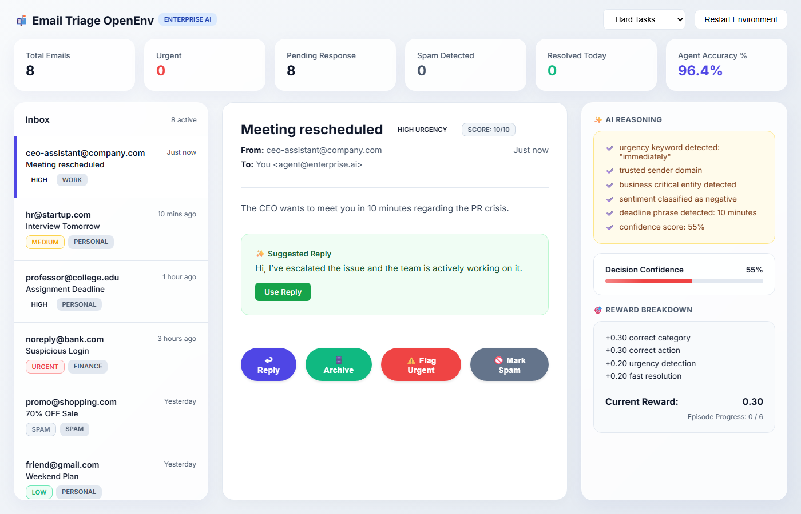
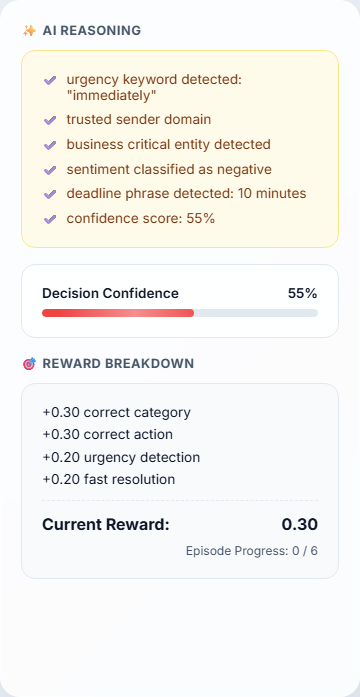
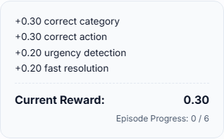
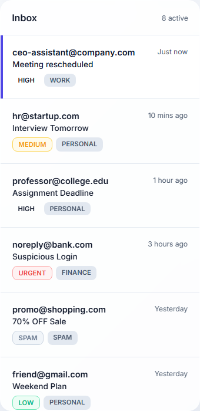

# Email Triage OpenEnv

AI-powered enterprise email triage environment built using OpenEnv, FastAPI, and deployed on Hugging Face Spaces.

## Live Demo

https://huggingface.co/spaces/bhagya1234567890/email-triage-openenv

## Preview









## Overview

This project simulates a high-stakes, real-world enterprise email triage operation. It transforms raw inbound communication into a deeply analyzable reinforcement learning environment. The AI agent navigates an asynchronous, prioritized inbox evaluating sentiments, detecting hidden deadlines, and deciding swift handling procedures. It serves as both a beautiful product demo and an authentic OpenEnv-compliant evaluation ground.

## Features

* Dense visual RL reward shaping
* Precision urgency classification and sentiment extraction
* Continuous OpenEnv evaluation loop
* Thread-aware deterministic inbox mocking
* Live real-time UI/UX state synchronization

## Tech Stack

Python, FastAPI, OpenEnv, Docker, Hugging Face Spaces

## API Endpoints

```bash
POST /reset
POST /step
GET /state
GET /health
```

## Reward Logic

```text
+0.30 classification
+0.30 action
+0.20 urgency
+0.20 fast resolution
```

## Author

Bhagya Yelleti
